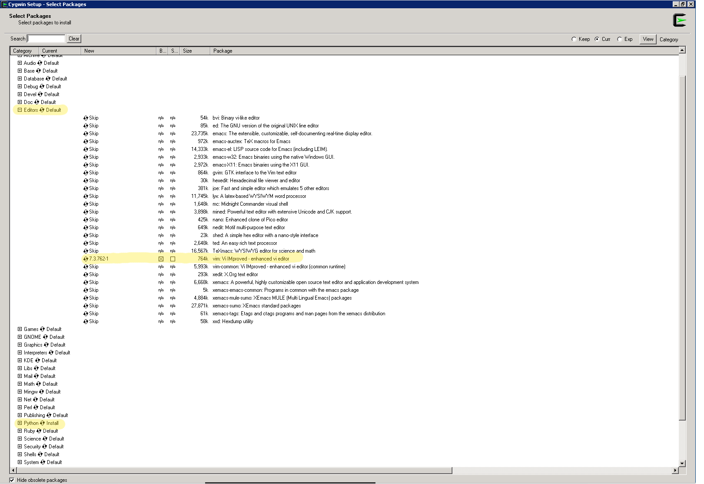

==============
How to install
==============

Before you can begin installation check that your system has ``curl`` library
installed.

Windows
-------

First step, that you have to do there is install Cygwin_.

.. _Cygwin: http://cygwin.com/install.html

Be careful in installation preferences add Python and any Text Editor.

Your home directory path is: ::

  c:\instalation_path\home\windows_user_name\

Default instalation_path is cygwin

Other things like Linux / MacOS installation.

Linux and MacOS
---------------

Put on your console below command to install.::

  $ curl https://raw.github.com/vi4m/beast/master/install.sh | bash -

Now do you need configuration file. In your home directory create directory
``.beast`` and add text file named ``config``. ::

  $ EDITOR ~/.beast/config

and add: ::

  username="jan.kowalski"
  api_key="478457f9f32323201ebde8ef79cd9d3a028ced56747"
  url="https://ralph-url.com"
